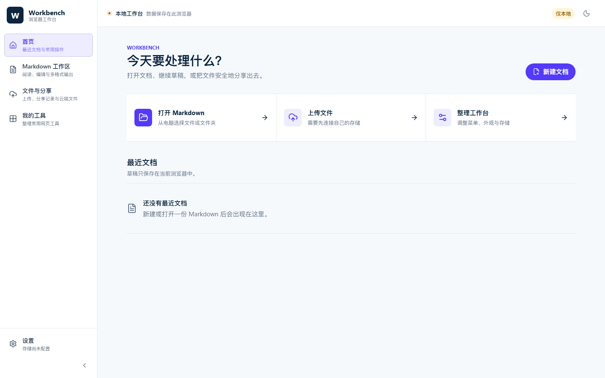

# Workbench

Workbench 是一个在浏览器里使用的文档工作台。你可以直接打开、编辑、阅读和导出 Markdown 文档；所有基础功能都在本机运行，不需要注册账号，也不需要先配置云存储。

## 安装

普通用户的正式安装入口是浏览器扩展商店。安装后点击浏览器工具栏中的 Workbench 图标即可使用，不需要开发环境或命令行。

| 浏览器 | 正式安装状态 |
| --- | --- |
| Chrome | 商店版准备中 |
| Edge | 商店版准备中 |
| Safari | 商店版准备中 |

当前发布的 `0.1.4` 是商店上线前的公开预览版。Chrome 和 Edge 用户可以[下载预览版](https://github.com/wasteball/workbench/releases/tag/v0.1.4)，按照页面中的安装说明提前体验。Safari 暂未提供普通用户可安装的版本。

安装 Chrome / Edge 公开预览版

预览版尚未进入浏览器商店，因此需要手动加载一次：

1. 在[发布页面](https://github.com/wasteball/workbench/releases/tag/v0.1.4)下载对应浏览器的 ZIP 文件。
2. 右键 ZIP 文件并选择“全部解压”。
3. Chrome 在地址栏打开 `chrome://extensions`；Edge 打开 `edge://extensions`。
4. 开启页面上的“开发者模式”。
5. 点击“加载已解压的扩展程序”，选择刚刚解压的文件夹。

这是预览期的临时安装方式。商店版上线后，不再需要以上步骤。

## 第一次使用

安装完成后即可直接使用：

1. 点击 Workbench 图标，选择“打开工作台”。
2. 新建文档，或从电脑打开已有的 Markdown 文件。
3. 编辑完成后，可导出为网页、Word 文档或 Markdown 文件，也可以通过浏览器保存为 PDF。

本地打开、编辑、预览和导出都不需要配置存储。只有使用“上传并分享”时，才需要连接自己的存储服务。

## 功能清单

### 1. 文档工作台：安装后即可使用

- **打开文档**：从电脑选择一个或多个 Markdown 文件，也可以直接打开整个文件夹。
- **新建与编辑**：新建文档并持续编辑，意外关闭后可以恢复尚未导出的草稿。
- **阅读与直接编辑**：默认显示排版后的正文；需要修改时直接编辑正文，高级用户也可以打开整篇 Markdown 源文件。
- **丰富内容显示**：正确显示表格、待办事项、代码、数学公式和流程图。
- **文件与目录导航**：在左侧切换文件，并通过文档目录快速定位当前标题。
- **查找、替换与审阅**：查找选中文字、替换当前项或全部结果，并逐项查看或撤回未保存改动。
- **阅读偏好**：调整正文字体、字号、版心宽度和界面颜色。
- **多种导出格式**：导出为 Markdown、独立网页或可继续编辑的 Word 文档，也可保存为 PDF。
- **从网址打开**：读取公开的 Markdown 网址、GitHub 文件页和 Gist 内容。

### 2. 文件上传与在线分享：按需开启

- **上传文件**：把文件上传到你选择的存储服务，并查看上传结果。
- **分享文档**：把当前文档生成网页、Word 文档或 Markdown 文件后上传，获得分享链接。
- **分享记录**：在当前浏览器中查看、搜索和再次复制以前生成的分享链接。
- **连接自己的存储**：支持单位或服务提供的上传连接，也支持个人的阿里云 OSS。

不配置存储时，这一组功能保持关闭，不影响文档工作台的任何本地功能。连接信息只在“设置 → 云端分享”中维护一处。

### 3. 个性化工作台：按习惯调整

- **调整菜单顺序**：拖动常用功能，决定它们在工作台中的排列。
- **精简菜单**：隐藏暂时用不到的功能，并选择浏览器快捷菜单中显示的项目。
- **添加网页工具**：把常用网页添加到工作台，作为自己的快捷能力。
- **统一设置**：在同一个设置中心管理外观、导出、菜单、云端分享和本地数据。

## 数据与隐私

- 文档默认只在本机处理，打开本地文件不会触发上传。
- 只有你主动选择“上传”或“在线分享”时，内容才会发送到你连接的存储服务。
- 不连接存储，也能正常新建、打开、编辑、预览和导出文档。
- Workbench 没有自有账号、广告、遥测或内置云端后台。
- 卸载扩展或清除扩展数据会删除当前浏览器中的草稿和本地记录，不会删除已经导出的文件。

详细规则见[隐私说明](PRIVACY.md)。需要使用阿里云存储或单位提供的上传服务时，再阅读[存储连接指南](docs/storage-configuration.md)。

## 当前版本说明

`0.1.4` 是当前公开预览版。Chrome 和 Edge 已生成可安装的预览包；Safari 仍需完成商店打包、签名和真机验收。尚未迁移的旧版能力记录在[功能迁移矩阵](docs/feature-migration.md)中。

发现问题可以提交 [GitHub Issue](https://github.com/wasteball/workbench/issues)。安全问题请按[安全策略](SECURITY.md)私下报告。

## 参与开发

源码环境、项目结构、测试和发布流程只面向贡献者，统一放在[贡献指南](CONTRIBUTING.md)中，不属于普通用户的安装步骤。

Workbench 使用 [MIT License](LICENSE) 开源。
