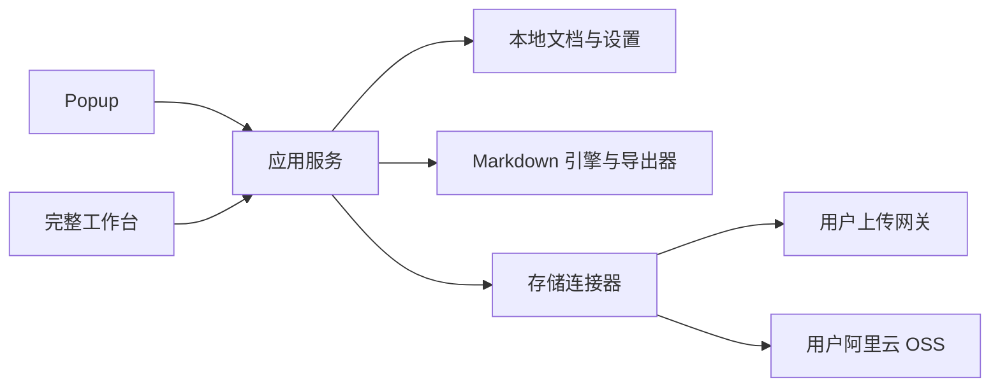

# Workbench

Workbench 是一个本地优先的浏览器文档工作台。它把 Markdown 阅读、编辑、导出和文件分享放进同一个扩展，同时允许用户连接自己的存储，而不是把文档交给一个内置云服务。

> 当前提供 0.1.0 公开预览版。Chrome、Edge 和 Safari 构建均可生成；Edge 已完成自动化浏览器验证，Chrome 构建已通过 Chromium 兼容性回归，Safari 仍需在 macOS 与 Xcode 中完成转换、签名和实机验收。


## 当前能力

- 从电脑打开多个 Markdown 文件或整个文件夹，也可从 Markdown 网址、GitHub 文件页和 Gist 读取内容。
- 新建并编辑文档，使用源码、分屏和阅读三种模式；自动保存浏览器恢复草稿。
- 渲染 GFM 表格和任务、代码高亮、KaTeX 公式与 Mermaid 图表。
- 导出 Markdown、独立 HTML 和可编辑 DOCX，或使用浏览器打印/另存为 PDF。
- 上传文件、查看本地分享记录，并将 Markdown 直接生成为 HTML、DOCX 或 Markdown 后分享。
- 连接已有上传网关，或使用阿里云 OSS 长期 AccessKey / STS 临时凭证。
- 调整菜单顺序、显示状态和 Popup 快捷项，添加自己的网页快捷方式。
- 在一个设置中心管理外观、输出、菜单、存储、配置迁移与本地数据。

完整迁移状态见[功能迁移矩阵](docs/feature-migration.md)。尚未完成的旧版能力会明确标记，不会在发布说明中隐去。

## 本地优先意味着什么

- 打开本地文件不会触发上传。
- 未修改的本地文件正文不会被复制到浏览器数据库；第一次编辑后才保存恢复草稿和原始基线。
- 未连接存储时，Markdown 打开、编辑、预览、本地导出和打印仍然可用。
- 只有用户主动上传或在线分享时，内容才会发往当前选择的存储服务。
- Workbench 不提供自有账户、遥测或云端后台。网络请求只发往用户主动打开的网址、配置的上传网关或阿里云 OSS。

更多信息见[隐私说明](PRIVACY.md)和[存储配置指南](docs/storage-configuration.md)。

## 从源码安装

需要 Node.js 22、23 或 24，以及 npm。

```bash
npm ci
npm run build:chrome
```

Chrome：

1. 打开 `chrome://extensions`。
2. 开启“开发者模式”。
3. 选择“加载已解压的扩展程序”。
4. 选择 `.output/chrome-mv3`。

Edge：

```bash
npm run build:edge
```

打开 `edge://extensions`，开启开发人员模式，然后加载 `.output/edge-mv3`。

Safari：

```bash
npm run build:safari
```

该命令只生成 `.output/safari-mv2` Web Extension 资源。Safari 安装包还需要在 macOS 上使用 Xcode 转换和签名，步骤见[Safari 构建指南](docs/safari-build.md)。

## 首次使用

安装后可以直接新建或打开 Markdown，不需要先配置存储。

需要上传或在线分享时：

1. 打开完整工作台。
2. 进入“设置 → 存储连接”。
3. 选择已有上传网关或新建阿里云 OSS 连接。
4. 填写自己的连接信息并保存。
5. 执行“测试连接”，确认当前会话实际具备的权限。

存储配置只保留这一处。文件与分享、Markdown 在线分享和 Popup 会共同使用当前连接。

## 存储方式

| 方式 | 适合谁 | 当前边界 |
| --- | --- | --- |
| 上传网关 | 已有兼容上传接口的用户 | 使用 multipart 字段并读取返回链接；只有上传能力，接口契约未确认前不承诺远端列表、删除或链接公开性 |
| 阿里云 OSS AccessKey | 单人、自主管理 RAM 权限的用户 | 支持长期 AccessKey；Secret 可只用于当前会话，也可由用户明确选择保存在当前浏览器 |
| 阿里云 OSS STS | 有自有服务端、希望使用短期凭证的用户 | 扩展只保存 STS 服务配置，临时凭证按过期时间刷新；签发服务需自行部署 |

请使用独立 RAM 用户和最小权限，不要填写阿里云主账号 AccessKey。STS 协议和服务端示例见[STS 集成指南](docs/sts-integration.md)。

## 开发

```bash
npm run dev
npm run docs:check
npm run lint
npm run check
npm test
npm run build:chrome
npm run build:edge
npm run build:safari
```

项目采用 WXT、React 和 TypeScript。主要边界如下：



- `src/entrypoints/`：Popup 和完整工作台入口。
- `src/app/`：应用外壳、路由、统一设置与能力注册。
- `src/features/`：Markdown、文件与分享、网页工具和设置页面。
- `src/connectors/`：与界面隔离的存储连接器。
- `src/platform/`：浏览器权限、文件选择和下载差异。
- `src/shared/`：持久化、类型与共享组件。

新增能力应通过既有注册表、服务或连接器边界接入，避免让页面直接依赖特定浏览器 API 或存储厂商。详细约束见[贡献指南](CONTRIBUTING.md)。

## 发布边界

GitHub 预览版发布和浏览器商店提交均应使用[发布检查清单](docs/release-checklist.md)。当前仍需完成的外部验收：

- 上传网关缺少经过确认的非敏感接口契约和真实环境验收。
- Chrome 稳定版已停止支持自动化测试中使用命令行加载未打包扩展；商店提交前仍需在 Chrome 的扩展管理页完成一次人工加载验收。
- Safari 需要 macOS、Xcode、签名账号和真实 Safari 回归。
- 功能迁移矩阵中标记为“待迁移”的首版项目仍需实现或由维护者明确调整范围。

## 安全与许可

安全问题请按[安全策略](SECURITY.md)私下报告。项目采用 [MIT License](LICENSE)；第三方依赖及其许可证见 `THIRD_PARTY_NOTICES.md`。
